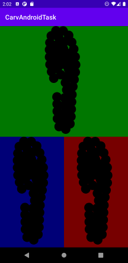

# Carv tasks

This repository contains exercises DynamicView and PubSub.

## DynamicView

The created `DynamicView `  adjust itself to the size of its container and is also centered. It also takes into account the padding used to draw the shape.

## PubSub

I completed this tasks using generics and added a `PubSubTest` to prove it takes any data as input